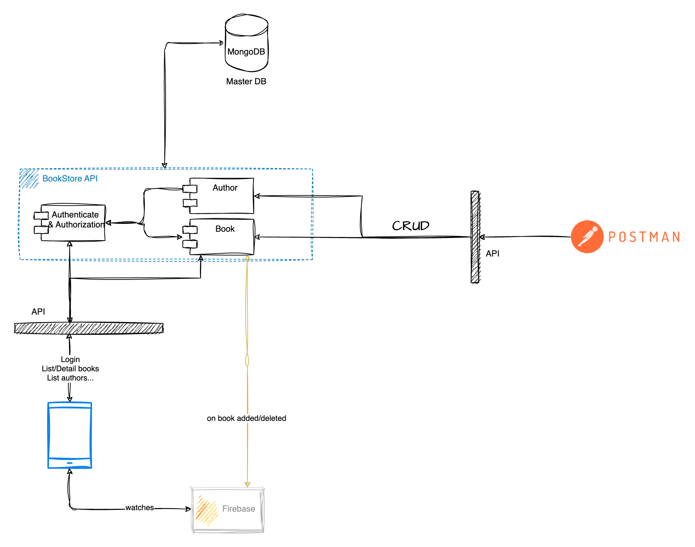

# Book store

## Architect
A simple system that handle book library.

### Techstack consideration:

**Golang:** due to the powerful performance and the best fit for microservice.
    
- The API code is well-prepared for the PRD environment.

**MongoDB:** For a management site, it is better to use SQL. Given that we might need a flexible data model, the use case should be researched clearly before choosing DB. Multiple databases are a good solution in some use cases. MongoDB was used as a project requirement, not a technical consideration in this project.

- In the production environment, we can set up a separate cluster or any vendor-managed MongoDB cluster.

- For development, docker-compose is used to boost the infrastructure. As it is simple and all in one go.

**Firebase:** Communicating from server to client is always a challenge. There are several ways to handle it, and each of them has its own pros and cons. So depends on the stack, non-functional requirements, use cases… We would implement an appropriate solution.

    - WebSocket

    - Push notification

    - Message queue

    - Firebase

    - …

- In this puzzle, we choose Firebase due to it:

    - Free with 10GB of data stored. A library of books won’t create that much event data. We can even optimize the data transfer using techniques like minimizing redundant data, using the binary format.

    - High availability and well-prepared for the PRD environment, as it’s Google’s product and used worldwide. The SDK helps to maintain a reliable connection with the Firebase DB server.

    - Reduce the server’s overhead by letting the Firebase server handle real-time communication with the client.

**Docker:**

- Containerized, production ready.

- In case of scalability is a concern, then there’s nothing better.

## Setup
### Prerequisites
[Go installed](https://go.dev/doc/install)
[Docker engine installed](https://docs.docker.com/desktop/install/linux-install/)
[Docker-compose installed](https://docs.docker.com/desktop/install/linux-install/)

### Infra setup
MongoDB by default run as 27017
For local server, we skip the password part.
`docker-compose up`

### Go build
`go build`

### Start web server
`bookstore.com`
